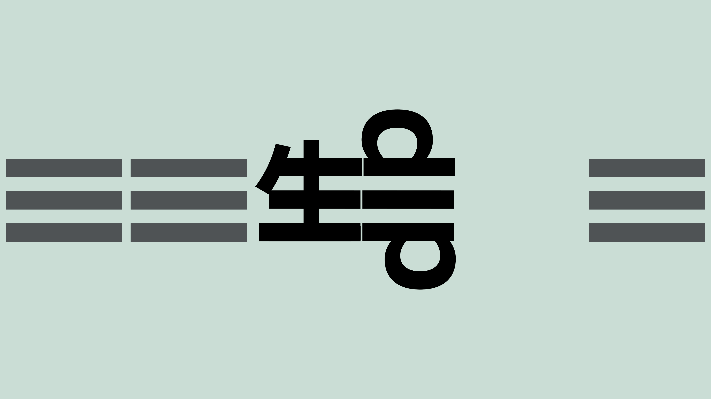

  

# yt-dlp-html-command

使用纯 HTML、CSS 和 JavaScript 构建的 yt-dlp 命令生成器 Web 界面。A web interface for generating yt-dlp commands, built with pure HTML, CSS, and JavaScript.

## 项目简介

本项目旨在提供一个简单易用的 Web 界面，帮助用户快速生成复杂的 yt-dlp 命令。无需记住繁琐的命令行选项，即可轻松下载和处理视频、音频和字幕。

## 功能特性

* **可视化界面：** 通过直观的表单和选项，轻松构建 yt-dlp 命令。
* **多平台支持：** 纯 HTML 实现，可在任何支持 Web 浏览器的平台上使用。
* **主题切换：** 提供暗色、亮色和纯黑 OLED 主题，满足不同用户的偏好。
* **实时预览：** 实时显示生成的 yt-dlp 命令，方便用户检查和修改。
* **选项分组：** 将 yt-dlp 选项按功能分组，方便用户查找和使用。
* **命令历史：** 自动保存上次选项到浏览器，无需登录，方便用户重复使用。

## 使用方法

1.  打开 [项目地址](https://eachgo.github.io/yt-dlp-html-command/yt-dlp-html-command.html)。
2.  根据需要选择选项和填写表单。
3.  实时生成的 yt-dlp 命令将显示在界面下方。
4.  复制命令并在命令行中使用。
5.  或者，您可以下载项目中的 HTML 文件，将其复制到 U 盘中，并在任何支持 Web 浏览器的设备上离线使用。

## 命令历史

本项目使用浏览器的本地存储功能，自动保存您上次的选项，无需登录。这意味着您可以在关闭浏览器后，下次打开时仍然看到上次的选项。请注意，清除浏览器缓存或更换浏览器可能会导致历史记录丢失。

## 主题切换

点击导航栏底部的按钮，即可切换主题。

## 依赖

本项目不依赖任何第三方库。

## 许可证

本项目使用 [MIT 许可证](https://opensource.org/licenses/MIT)。

## 联系方式

如有任何问题或建议，请通过 [GitHub Issues](https://github.com/eachgo/yt-dlp-html-command/issues) 联系。

## 项目地址

https://github.com/eachgo/yt-dlp-html-command/
